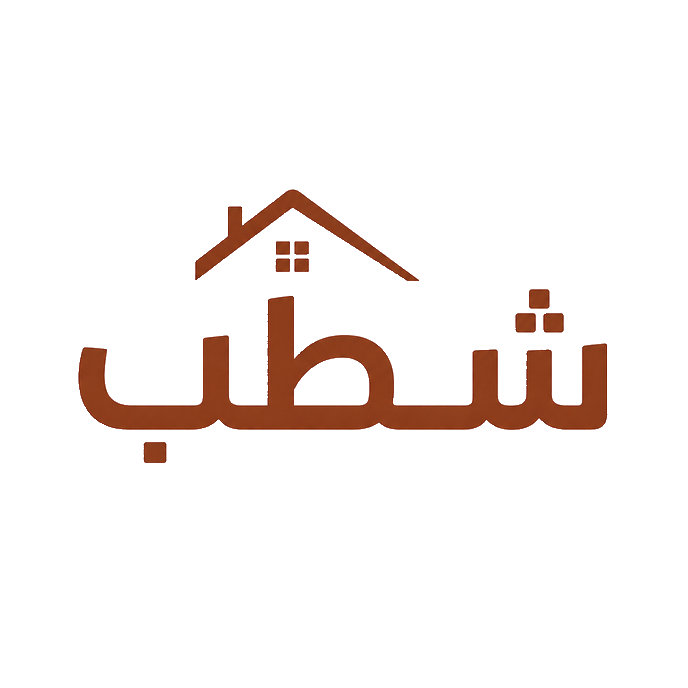

# Shattab Brand Identity — Full Guidelines v2.0

Status: full working brand guideline
Date: 2026-08-26
Applies to: Shattab product, marketing, social, partnerships, physical
materials, and future brand extensions

This document is the strategic working source of truth for how Shattab looks,
sounds, moves, and behaves across the brand. It is intentionally specific
enough for a product designer, engineer, copywriter, photographer, or external
studio to use without inventing a second interpretation of the identity.

For product UI composition and screen-level visual decisions, use the
canonical `docs/brand-ux-board.md`. It applies these brand rules to actual
journeys, states, and interface patterns.

The compact implementation contract lives in
design-system/shattab/MASTER.md. The quick handoff lives in
docs/brand-kit/README.md. The visual board is an art-direction reference for
the identity, while the product UX board is the canonical screen-level source.
Neither replaces the base logo artwork or the rules in this document.

## 0. Brand at a glance

### Name

- Arabic product name: شطّب
- Latin product name: Shattab
- Product tier: شطّب Pro / Shattab Pro
- Master line: From idea to finish.
- Arabic campaign line: من أول فكرة لآخر لمسة

### Category

An Egyptian home-finishing marketplace connecting homeowners with relevant,
visible, and contactable professionals.

### Core idea

Shattab turns a home-finishing need into a clear next step: discover the right
professional, see real work, compare the options, request a quote, and move
the project forward.

### Brand promise

Make home finishing easier to start, easier to compare, and easier to trust.

### Personality

- Warm, not childish.
- Capable, not corporate.
- Egyptian, not slang-heavy.
- Reassuring, not over-promising.
- Practical, not industrial.

### One-sentence test

If a piece of work does not make the project feel clearer, more credible, or
closer to finished, it is probably not Shattab.

## 1. Strategic foundation

### Mission

Help people make better home-finishing decisions by connecting them to the
right professionals and making the evidence easy to see.

### Vision

A home-finishing market where good work is discoverable, expectations are
clear, and skilled professionals can build trusted reputations.

### The problem

Homeowners often start with a vague need and no reliable way to judge who can
help. Professionals often have the skill but lack a consistent way to reach
relevant work. The result is wasted time, uncertainty, and decisions made on
weak evidence.

### The role Shattab plays

Shattab is the bridge between need and craft. It should feel like a confident
first step, not like a classifieds board, a generic social network, or a
faceless lead marketplace.

### Differentiation

Shattab earns distinction through the combination of:

1. Egyptian context rather than imported real-estate language.
2. Real work and visible portfolios rather than claims alone.
3. Matching by specialty and area rather than an undifferentiated directory.
4. Clear requests and quotes rather than ambiguous conversations.
5. Direct WhatsApp and call contact when the user is ready.
6. A warm, calm identity that respects both the homeowner and the craftsperson.

### Brand values

#### Evidence

Show the work, the specialty, the service area, the quote, and the verification
state. Never make adjectives do the work of proof.

#### Clarity

Every screen, message, and campaign should make the next action obvious.

#### Local respect

Use language, examples, imagery, and contact behaviors that feel native to
Egyptian users without turning the brand into a caricature.

#### Dignity of craft

Professionals are skilled people building a reputation. Show their work with
care and avoid visual language that makes them look like anonymous labor.

#### Honest progress

Celebrate movement from brief to quote to completed work. Do not imply that
Shattab guarantees the outcome of a project or the quality of every listed
professional.

## 2. Audiences and what they need to feel

### Homeowner

The homeowner may be finishing an apartment, villa, room, or repair project.
They need:

- confidence that the professional is relevant
- a fast way to inspect real work
- transparent next steps
- a clear path to request or compare quotes
- contact that feels familiar and immediate

The brand should make them feel: I can start here, I can see enough to compare,
and I know what happens next.

### Finishing professional

The professional may be a contractor, painter, electrician, plumber, carpenter,
tiler, or finishing specialist. They need:

- relevant leads instead of random traffic
- a credible portfolio
- a profile that communicates skill quickly
- a simple way to send a quote
- a clear route to direct contact

The brand should make them feel: my work is visible, my expertise is respected,
and the right clients can find me.

### Internal team and partners

The team needs a consistent rule for what can be claimed, shown, promoted, and
verified. Partners need a brand that looks local, reliable, and ready to work
with without appearing bureaucratic.

## 3. Brand architecture

### Master brand

Shattab is the only master brand. The Arabic and Latin names refer to the same
company and product.

### Product surfaces

Use the master brand consistently across:

- homeowner discovery
- homeowner requests
- saved professionals
- contractor opportunities
- contractor inbox
- portfolio
- verification
- quotes
- reviews
- account and onboarding

### Shattab Pro

Shattab Pro is a product tier, not a separate company or visual identity.

Use:

- the same base logo
- the same IBM Plex Sans Arabic type family
- the same terracotta and cream foundation
- deeper charcoal surfaces
- restrained gold only for premium detail and plan comparison

Do not:

- invent a new Pro logo
- use a separate color system
- make Pro look like a luxury unrelated brand
- promise requests, ratings, or outcomes that the product cannot guarantee

### Trust labels

Verified, featured, sponsored, and tier labels must remain visibly different
from one another.

- Verified means a defined identity or business check was completed.
- Featured means editorial or product placement.
- Sponsored means paid placement.
- Tier means a product-defined level based on explicit criteria.

Never use one badge to imply another.

## 4. Naming and language rules

### Spelling

Use شطّب in Arabic product copy and Shattab in Latin copy.

Do not alternate between:

- شطب
- شطّب
- شطاب
- Shatab
- Shattab App
- Shattab Marketplace

The only approved Arabic product spelling is شطّب. The logo is custom artwork
and may simplify marks at very small sizes, but written copy keeps the shadda.

### Transliteration and casing

- Use Shattab with a capital S in headings and sentence starts.
- Use shattab.app only as a URL, never as the product name.
- Do not write SHATTAB in normal product copy.
- An all-caps Latin treatment is allowed only as a small campaign label.

### Arabic and English relationship

Arabic is the primary product language and must be treated as native RTL.
English is a supported LTR expression, not a replacement for Arabic.

When both names appear:

- Arabic is visually primary in Arabic-first contexts.
- Latin is a supporting descriptor.
- Keep the two lockups optically balanced rather than forcing identical widths.
- Never rebuild the Arabic logo with typed text.

### Numerals

Use Western numerals consistently in product UI, prices, dates, phone numbers,
counts, and marketing data:

- 56 projects
- 8 years
- 25,000 EGP

If a legal or user-supplied string contains Arabic-Indic numerals, preserve the
user content where required, but do not introduce mixed numeral styles in one
component.

## 5. Base logo system

### Base-logo decision

The existing visible base mark is the authority for the Shattab identity. It is
the terracotta Arabic شطّب lockup with the roof-line form above it.

The mark must be used as supplied. The brand system may define placement,
scale, color background, and surrounding layout, but it must not redraw the
letterforms or replace the roof-line form with another symbol.

### Current source assets

The current visible base-logo family is:

- assets/icon/app_icon.png — full app-icon composition with field and mark
- assets/icon/app_icon_foreground.png — transparent base mark used for
  adaptive-icon and splash contexts
- assets/images/logo_wordmark.png — transparent cropped base mark used by
  product surfaces

The transparent wordmark asset is derived from the existing visible foreground
artwork so current app logo references use the same base logo.

The existing SVG files in assets/icon/ must be reconciled with the visible PNG
base mark before they are treated as master vector artwork. Until that
reconciliation is approved, use the PNG base assets above for brand output and
do not present the SVG geometry as a new logo direction.

The exact visual reference is [shattab-base-logo-sheet.svg](brand-kit/shattab-base-logo-sheet.svg).

### What the base logo communicates

- Roof line: home and the place where the project begins.
- Arabic wordmark: local relevance and direct recognition.
- Solid terracotta form: warmth, material, confidence, and visible craft.
- Compact silhouette: recognition at app-icon and small digital sizes.

The logo is not a literal guarantee of a completed project. It is a mnemonic
for the place, the craft, and the act of finishing.

### Logo versions

#### Primary base lockup

The full terracotta base mark on a quiet warm-cream field. Use for:

- app icon
- onboarding
- splash
- website header
- social avatar
- presentation cover
- partner introductions

#### Reversed base lockup

The cream base mark on terracotta or charcoal. Use only after the reversed
artwork has been exported from the approved master. Do not create it by using a
CSS filter, opacity trick, or screenshot.

#### Monochrome base lockup

Charcoal on warm cream or warm cream on charcoal. Use for:

- black-and-white print
- legal documents
- invoices
- embroidery
- embossing
- one-color partner placements

#### Compact mark

Use the mark without extra naming when the surface is too small for a
descriptive lockup:

- app icon
- avatar
- favicon
- notification origin
- small status header

Do not create a second symbol for compact use.

### Clear space

Define clear space using the height of the base logo’s central vertical stem.
Keep at least one stem-height of empty space on all four sides.

For crowded environments, increase clear space to two stem-heights. Clear
space is measured to the nearest visible edge of the artwork, not to the edge
of a transparent file.

### Minimum sizes

Digital minimums:

- 24dp: compact mark only, for a clearly branded context
- 40dp: product header or navigation context
- 64dp: account, onboarding, or profile identity
- 96dp: splash or welcome context
- 192px: social avatar and raster export baseline

Print minimums:

- 12mm for a compact one-color mark
- 20mm for the full base lockup
- 30mm or larger when the artwork sits on textured or photographic material

If the mark cannot be read at the intended size, use the compact mark. Never
shrink the full lockup until it becomes decorative noise.

### Placement

Preferred placement:

- centered on quiet fields
- aligned to the main content column
- placed at the top of a calm cover or onboarding composition
- used once as the strongest identity element

Avoid:

- placing the mark over a busy photo
- placing it next to another company logo at equal size without a divider
- locking it to the bottom navigation as a decorative fifth tab
- using it as a watermark behind dense forms

### Logo misuse

Never:

- stretch or compress the base logo
- rotate it
- redraw the Arabic letters
- remove the roof line
- turn the roof line into a generic house icon
- add a drop shadow, bevel, glow, or gradient
- outline the wordmark
- put it inside an unrelated badge
- change the shadda in written product copy
- place a busy photograph directly behind it
- use a different symbol for Shattab Pro

## 6. Color system

### Core palette

| Role | Token | Hex | Meaning |
| --- | --- | --- | --- |
| Terracotta | brandTerracotta | #9E3D18 | Primary action, signature warmth |
| Warm cream | brandCream | #FFF8F3 | Canvas, breathing room, trust |
| Charcoal | brandCharcoal | #1F1B14 | Text, ink, deep frame |
| Olive | brandOlive | #5C614D | Verification, positive state, confidence |
| Sand | brandSand | #E4DCCC | Supporting surfaces, material tone |
| Gold | brandGold | #735C00 | Rating and premium detail only |

### Product support colors

These existing product roles may appear when the interface needs state or
surface hierarchy:

| Role | Hex | Use |
| --- | --- | --- |
| Soft terracotta plate | #FFDBD0 | Primary containers and selected light states |
| Light terracotta | #FFB59D | Inverse or fixed light accent |
| Soft olive plate | #E0E5CC | Positive and verified containers |
| Soft gold plate | #FFE088 | Rating and premium containers |
| Card white | #FFFFFF | Elevated content surfaces |
| Soft cream | #F5EDE3 | Secondary surface grouping |
| Charcoal variant | #4A3630 | Secondary text on light surfaces |
| Outline | #8A726A | Borders and control boundaries |
| Outline soft | #DEC0B7 | Quiet hairlines and dividers |
| Error | #BA1A1A | Error state only |
| Star gold | #E6AC43 | Filled rating stars on light cards |

### Color hierarchy

The visual order is:

1. Warm cream for the majority of the canvas.
2. Charcoal for reading and primary information.
3. Terracotta for the primary action and signature moments.
4. Olive for verified or positive state.
5. Sand for quiet grouping and material warmth.
6. Gold for small rating or premium emphasis.

Terracotta should be recognizable without taking over every screen. Dense
workflows stay mostly cream, white, and charcoal.

### Color behavior by surface

#### Light product surface

- Background: warm cream.
- Cards: white or soft cream.
- Primary action: terracotta with a white label.
- Text: charcoal.
- Secondary text: charcoal variant.
- Verified state: olive plus a label or icon.
- Rating: gold plus a numeric value or star shape.

#### Dark product surface

- Background: charcoal.
- Cards: dark warm tonal layers.
- Primary action: light terracotta or terracotta container with a dark label.
- Text: warm cream.
- Positive state: light olive on a dark olive container.
- Gold remains restrained and never becomes a neon highlight.

#### Marketing surface

Marketing may use a full terracotta field or a charcoal frame when the
composition is spacious. Always maintain a quiet area for the logo and message.

### Accessibility

Never use color as the only status signal. Pair color with:

- a label
- an icon
- a shape
- a value
- a change in state

Every text, icon, button, and essential border combination must be checked for
contrast in light, dark, and increased-contrast themes.

### Forbidden color behavior

- No blue-purple generic AI gradient.
- No rainbow gradients.
- No fluorescent neon.
- No WhatsApp green as a Shattab brand color.
- No gold primary CTA.
- No functional red used as decoration.
- No unapproved competitor brand colors as large UI surfaces.

## 7. Typography system

### Primary family

Use the bundled IBM Plex Sans Arabic family for Arabic and Latin product
surfaces. It keeps Arabic, English, numerals, and mixed labels coherent without
runtime font downloads.

The current source is:

- assets/fonts/IBMPlexSansArabic-400.ttf
- assets/fonts/IBMPlexSansArabic-500.ttf
- assets/fonts/IBMPlexSansArabic-600.ttf
- assets/fonts/IBMPlexSansArabic-700.ttf

### Weights

- 400: body and supporting explanation
- 500: labels, filters, metadata, and low-emphasis controls
- 600: titles, buttons, tabs, and important labels
- 700: display, hero, and major section headings

Do not introduce Cairo, Tajawal, Inter, or runtime font downloads into the
product without a measured Arabic readability review.

### Product type scale

The implementation scale is:

| Style | Size | Leading | Weight | Use |
| --- | ---: | ---: | ---: | --- |
| Display large | 40 | 56 | 700 | Brand moments and hero identity |
| Display medium | 34 | 48 | 700 | Major onboarding or section lead |
| Headline large | 28 | 40 | 700 | Screen title |
| Headline mobile | 26 | 38 | 700 | Compact screen title |
| Headline medium | 24 | 34 | 700 | Major card or content title |
| Headline small | 20 | 29 | 700 | Small section heading |
| Title large | 20 | 28 | 600 | Main card and page title |
| Title medium | 18 | 26 | 600 | Secondary title |
| Body large | 17 | 26 | 400 | Introductory copy |
| Body medium | 15 | 24 | 400 | Default body |
| Body small | 14 | 21 | 400 | Supporting text |
| Label large | 15 | 22 | 600 | Strong action or stat |
| Label medium | 13 | 18 | 500 | Control and metadata |
| Label small | 12 | 17 | 500 | Minor metadata |

### Arabic typesetting

- Never use negative tracking in Arabic.
- Keep generous leading for marks, dots, ascenders, and descenders.
- Do not justify short UI paragraphs.
- Keep Arabic line lengths comfortable; avoid edge-to-edge text.
- Align RTL content by meaning, not by mirroring every visual element.
- Do not force Latin punctuation into an Arabic sentence when the result reads
  incorrectly.

### Latin typesetting

- Use the same family to preserve the Shattab voice.
- All-caps is for short labels only.
- Keep tracking neutral or slightly open for small Latin labels.
- Avoid long all-caps paragraphs.
- Keep URLs and phone numbers LTR inside RTL layouts.

### Typography hierarchy

Headings are dark and decisive. Body copy is quieter. Terracotta is an accent,
not a substitute for hierarchy. A heading should still be readable in
monochrome.

## 8. Layout and composition

### Grid

Use an 8dp rhythm with 4dp micro adjustments only when optical alignment needs
them.

Core spacing:

| Name | Value | Use |
| --- | ---: | --- |
| Micro | 4dp | Glyph or icon adjustment |
| Intra | 8dp | Label/value or icon/label relationship |
| Compact inter | 12dp | Sibling controls and list rows |
| Page edge | 16dp | Compact screen edge |
| Page content | 20dp | Default content column |
| Group | 24dp | Card interior and section sides |
| Section gap | 28dp | Major content groups |
| Large | 32dp | Spacious content separation |
| Section | 40dp | Major section break |
| Hero | 48–80dp | Brand-expression breathing room |

### Gutters

- Compact mobile screen edge: 16dp.
- Standard content column: 20dp.
- Primary section or card interior: 24dp.
- Full-bleed campaign surfaces: opt out intentionally and preserve a quiet
  internal edge for text and logos.

### Corner language

| Surface | Radius |
| --- | ---: |
| Tiny control | 4dp |
| Chip or small field | 8–12dp |
| Button and input | 16dp |
| Image and media | 20dp |
| Card and major surface | 24dp |
| Pill | Full radius |

Corners are soft but moderate. Do not combine multiple unrelated radius
families in one component.

### Surfaces and depth

Prefer tonal layering before elevation:

1. background
2. soft cream grouping
3. white content card
4. raised or featured card
5. sheet or modal overlay

Shadows are low-opacity and terracotta-tinted. Never use a hard black drop
shadow as a brand effect.

### Composition rhythm

A strong Shattab composition usually contains:

- one clear message
- one evidence image or product surface
- one signature terracotta accent
- one finish-line detail
- one quiet area around the logo

Do not make every element loud. The brand should alternate between calm,
functional, tactile, and expressive moments.

### RTL rules

- Default product direction is RTL.
- Navigation order follows the information hierarchy of the language.
- Icons with directional meaning mirror only when their meaning changes.
- Logos do not mirror.
- Photos do not mirror unless the composition is explicitly art-directed.
- Keep phone numbers, prices, URLs, and technical IDs LTR where needed.

## 9. Graphic language

### Finish-line device

The finish line is the secondary graphic device derived from the roof-line idea.
It begins as an architectural edge and resolves into a clean completed corner.

Use it as:

- an underline under a campaign line
- a divider between a promise and an action
- a progress reveal in motion
- a small detail on a folder, card, or social template
- a quiet watermark on spacious surfaces

Rules:

- Use one finish line per composition unless a construction diagram requires
  multiple steps.
- Keep its stroke light to medium.
- Use terracotta on cream, cream on terracotta, or charcoal on sand.
- End with a clear resolved edge; do not turn it into a random squiggle.
- It supports the logo; it does not compete with the base logo.

### Roof-line form

The roof line belongs to the base logo first. Outside the logo, a simplified
roof-line stroke may appear only as the finish-line device. Do not repeat
literal roof icons throughout the interface.

### Supporting patterns

Approved supporting pattern families already exist in the product:

- lattice
- terrazzo
- arches
- contour

Use patterns:

- in onboarding and empty states
- in Pro or campaign surfaces
- at low opacity behind a single message
- as a cropped edge or texture, not a full dense background

Do not:

- place a pattern behind a form with long copy
- combine lattice, terrazzo, arches, and contour in one composition
- use a pattern to compensate for missing content
- make the product feel like wallpaper

### Lines and rules

- Use warm-tinted hairlines rather than neutral grey.
- Keep rules thin and purposeful.
- Align rules to the content grid.
- A divider should explain a relationship or transition.

## 10. Iconography

### Style

Use one consistent line-icon family with light-to-medium strokes, rounded ends,
and simple geometry.

Icons should feel:

- human
- clear at 20–24dp
- compatible with Arabic labels
- related to home, craft, navigation, contact, and progress

### Icon rules

- Minimum interactive hit area: 48dp.
- Icon alone is acceptable for universally understood actions.
- Add a label when meaning could be ambiguous.
- Use filled icons only for selected or active states when the family supports
  that distinction.
- Use the base logo, not a generic house icon, for Shattab identity.

### Approved motif meanings

The existing code-native motifs may be used in their intended roles:

- arch: home and space
- tile: craft and surface
- compass: direction and discovery
- finish: progress and completion

Motifs are supporting vocabulary, not alternate logos.

## 11. Photography and video

### Photography principle

Photography is evidence. It should make the work feel real before it makes the
brand feel aspirational.

### Subjects

Prefer:

- Egyptian apartments, villas, kitchens, bathrooms, and living spaces
- hands at work
- tile, plaster, paint, wood, stone, wiring, and fixtures
- tools in use
- before/after context with truthful labels
- finished spaces that still show material decisions
- professionals presented with dignity and consent

### Lighting and grade

- Warm-neutral natural light.
- Soft contrast with readable material texture.
- Terracotta or olive may appear naturally or as a restrained overlay.
- Avoid heavy orange filters that make every image look the same.
- Keep skin tones and material colors believable.

### Composition

- Show the work first; mood second.
- Crop for the decision the user needs to make.
- Leave quiet space for copy when the image is used in a campaign.
- Prefer one strong detail over a busy collage.
- Use 4:3 or 16:10 for product media unless the surface requires another ratio.

### People

Show real people when they add trust or craft context. Avoid:

- generic office teams
- stock handshake scenes
- anonymous hard-hat stereotypes
- faces used only as decoration
- unconsented identifiable people

### Before and after

Before/after pairs must:

- be from the same project
- use honest labels
- preserve comparable framing when possible
- avoid implying Shattab guaranteed the result
- identify when an image is illustrative rather than a verified project

### Video

Video should show:

- a material decision
- a short craft action
- a room transition
- a professional explaining a step
- a real project progression

Use restrained cuts and natural sound where possible. Do not use stock footage
of construction as a substitute for real Shattab work.

### Ready visual pack

The first visual pack is in [brand-kit/visuals/README.md](brand-kit/visuals/README.md).
It includes:

- [brand-system board](brand-kit/visuals/shattab-brand-system-board-v2.png)
- [4:5 campaign hero](brand-kit/visuals/shattab-campaign-hero-4x5.png)
- [9:16 story frame](brand-kit/visuals/shattab-story-9x16.png)
- [1:1 material still life](brand-kit/visuals/shattab-material-1x1.png)

These compositions use the supplied base logo and are intended as art-direction
templates. The matching source PNG plates are deliberately logo-free so
licensed real project photography can replace the concept scenes without
changing the identity system.

## 12. Illustration and 3D

Illustration is reserved for:

- onboarding
- empty states
- education
- campaigns
- system explanations

Illustration should reuse:

- the terracotta and cream palette
- the finish-line geometry
- simple architectural edges
- material-inspired texture

Avoid:

- cartoon houses
- random mascots
- glossy 3D tools
- generic AI blobs
- overly detailed scenes that compete with the action

3D may be used for a premium campaign only when it follows the same material
and lighting discipline. It is not the default product language.

## 13. Motion and interaction

### Motion principle

Motion communicates progress, hierarchy, and response. It should never be
used to hide missing content or make a simple action feel complicated.

### Timing

Use the product motion tokens:

| Moment | Duration |
| --- | ---: |
| Press feedback | 80–150ms |
| Small state change | 150–250ms |
| Standard entrance | 250–400ms |
| Page transition | 250–350ms |
| Hero or brand reveal | 400–600ms |
| Stagger step | 60ms |

### Motion behaviors

#### Entrance

Fade in with a small upward movement. Establish hierarchy from the top of the
screen or from the action that matters most.

#### Press

Use a subtle scale or tonal response, approximately 0.97 scale where the
component supports it, without causing layout shift.

#### Completion

Use a short finish-line resolution, check, or tonal confirmation. Completion
should feel earned and calm.

#### Navigation

Use fast fade or slide transitions that preserve context. Avoid dramatic
page-turn or elastic navigation.

#### Image loading

Fade images into the layout. Never let decoded photos pop in abruptly.

### Reduced motion

When reduced motion is enabled:

- remove travel and scaling
- keep essential state feedback
- use a near-instant linear transition
- never remove the semantic result of an action

## 14. Voice and tone

### Voice

Shattab speaks like a capable local guide who understands the stress of
finishing a home and respects the professional doing the work.

The voice is:

- direct
- warm
- practical
- honest
- encouraging
- specific

### Tone by moment

| Moment | Tone |
| --- | --- |
| Discovery | Curious and useful |
| Empty state | Reassuring and action-oriented |
| Quote flow | Clear and precise |
| Verification | Serious and transparent |
| Success | Warm and grounded |
| Error | Calm, accountable, and actionable |
| Pro promotion | Confident, never aggressive |
| Legal/consent | Formal and exact |

### Writing formula

When possible, write:

1. what happened
2. why it matters
3. what the user can do next

Example:

Your request is ready. Professionals in your area can now review the details.
You can update it any time.

### Approved message direction

Arabic product examples:

- ابدأ مشروعك
- اكتشف المحترفين
- اطلب عرض سعر
- شوف شغل اتعمل بجد
- ابعت تفاصيل مشروعك
- خلّي خطوتك الجاية أوضح
- العرض اتبعت بنجاح
- راجع العروض واختار المحترف الأنسب ليك

English support examples:

- Start your project
- Discover professionals
- Request a quote
- See real work
- Send your project details
- Make your next step clearer
- Quote sent successfully
- Review quotes and choose the right professional

### Avoid

- guaranteed results
- instant trust
- best contractor in Egypt without evidence
- fake scarcity
- unexplained abbreviations
- exaggerated urgency
- formal bureaucracy in everyday product guidance
- slang that feels forced or regionally narrow

### Trust language

Say exactly what was checked:

- Identity verified.
- Business verified.
- Verified review.
- Portfolio supplied by the professional.

Do not say:

- Shattab guarantees this professional.
- Every project has been reviewed.
- This work will definitely be completed to a certain standard.

## 15. Product expression by surface

### Splash

Look:

- warm cream field
- centered base logo
- restrained tagline
- minimal loader or progress response
- no competing illustrations

Behavior:

- base logo enters softly
- tagline follows
- loading remains quiet and short
- reduced motion removes travel and scale

### Onboarding

Look:

- one terracotta or warm-cream brand moment
- one clear headline
- real or art-directed craft image
- finish-line detail
- one primary action

Do not show the complete feature list on the first screen. Onboarding should
create confidence in the next step, not explain the whole database.

### Homeowner discovery

Look:

- warm cream canvas
- calm top bar
- search and location controls in quiet surfaces
- real work cards with clear names and specialties
- terracotta for the primary browse or request action
- olive only where verification or positive state is true

Content is the hero. The pattern remains secondary.

### Homeowner requests

Look:

- clear lifecycle states
- one primary action for the current stage
- progress or quote status expressed with label, icon, and color
- no competing button hierarchy

### Contractor opportunities

Look:

- operational and scannable
- clear location, specialty, timing, and request detail
- quote action in terracotta
- status in a calm tonal plate
- photo or pattern used only when it helps classify the work

### Contractor profile

Look:

- base identity first
- one clear tier or verification state
- real portfolio evidence
- stat line in type rather than a wall of chips
- primary contact/request action in terracotta
- WhatsApp and call available but visually secondary

The profile should feel like a professional proof page, not a social feed.

### Portfolio

Look:

- image-led
- consistent crop and spacing
- project title, category, year, and location easy to scan
- no fake before/after implication
- use warm cream and sand to keep the gallery quiet

### Quotes

Look:

- precise
- comparable
- readable price and duration
- details visible before decision
- acceptance and decline states explicit

### Verification

Look:

- calm and serious
- explain what was checked
- explain what the badge does not mean
- never use the badge as a decorative status sticker

### Shattab Pro

Look:

- charcoal or deep warm surface
- terracotta primary action
- restrained gold for plan or rating emphasis
- strong comparison hierarchy
- clear limitations and no-guarantee language

## 16. Marketing and campaign system

### Campaign idea

The recurring campaign thought is the movement from an unclear beginning to a
confident next step.

Possible campaign lines:

- From idea to finish.
- Start with the right professional.
- شوف شغل اتعمل بجد
- من أول فكرة لآخر لمسة
- Your next step, made clearer.

Use one line per asset. Do not stack several slogans.

### Social posts

Recommended formats:

- 4:5 feed post
- 9:16 story
- 1:1 avatar or announcement tile

Composition:

- one real project image or one material detail
- one short line
- base logo in a quiet corner
- terracotta finish-line detail
- one CTA or URL

### Website and landing page

Hero:

- warm cream or terracotta field
- base logo
- one direct headline
- one real project or professional image
- one primary action

Section rhythm:

1. promise
2. how it works
3. evidence of real work
4. professional side of the marketplace
5. trust and verification explanation
6. final action

### Partner placement

When Shattab appears beside another brand:

- keep the base logo clear and unmodified
- use a warm-cream or white quiet backing
- separate logos with a rule or adequate space
- avoid making Shattab appear to certify another company unless that is true

### Printed materials

Approved expressions:

- professional ID or verification card
- project folder
- quote or brief cover
- event badge
- partner one-pager
- simple sticker or label

Use:

- one-color base logo when production is limited
- cream paper, sand stock, terracotta ink, charcoal type
- restrained finish-line detail
- clear name, role, and verification meaning

Avoid glossy promotional merchandise with oversized logos.

## 17. Accessibility and inclusion

### Product requirements

- RTL-first layout and testing.
- 48dp minimum interactive hit area.
- Visible keyboard and focus states.
- Text must remain readable when enlarged.
- Never rely on color alone.
- Support reduced motion.
- Do not hide essential information in hover-only interactions.
- Keep captions, labels, and alternative text meaningful.

### Image inclusion

Show different home types, neighborhoods, budgets, professional specialties,
and household contexts without reducing Egypt to one visual stereotype.

### Trust and privacy

Never reveal a phone number, project image, location, or identity document
outside the context and permission that supports the user action.

## 18. Asset production specifications

### Logo exports

Required final exports:

- base mark on warm cream
- reversed mark on terracotta
- monochrome charcoal
- monochrome warm cream
- compact mark
- Arabic primary lockup
- Arabic plus Latin descriptor lockup, only if approved

Formats:

- SVG/PDF for master artwork
- PNG at 1x, 2x, and 3x for product use
- WebP/PNG for web and social where appropriate
- adaptive foreground/background assets for Android
- iOS icon exports with the required safe area

### File naming

Use:

- shattab-logo-primary
- shattab-logo-reversed
- shattab-logo-monochrome
- shattab-mark-compact
- shattab-icon-adaptive-foreground
- shattab-icon-adaptive-background
- shattab-finish-line

Include the color or mode only when the name needs disambiguation:

- shattab-logo-primary-terracotta-cream
- shattab-logo-reversed-cream-terracotta

### Photography exports

Product baseline:

- long edge at least 1200px
- 4:3 or 16:10 unless the surface specifies otherwise
- truthful crop
- no baked-in UI or logo unless it is a campaign asset
- usage rights recorded

### Current implementation references

The following files are the product implementation authority:

- lib/core/theme/batsh_colors.dart
- lib/core/theme/batsh_typography.dart
- lib/core/theme/batsh_spacing.dart
- lib/core/theme/batsh_radius.dart
- lib/core/theme/batsh_shadows.dart
- lib/core/theme/batsh_motion.dart
- lib/core/widgets/shattab_pattern.dart
- assets/icon/app_icon.png
- assets/icon/app_icon_foreground.png
- assets/images/logo_wordmark.png

## 19. Governance

### What can change without a brand review

- content layout
- spacing within the approved rhythm
- image crop within the approved photography direction
- functional state colors when required for accessibility
- copy length for clarity
- responsive behavior

### What requires brand review

- logo shape or letterform
- new color family
- new typeface
- new mascot or symbol
- new product tier identity
- claims about verification or outcomes
- campaign line intended for broad public use
- new image style that changes how Shattab is perceived

### Source-of-truth order

When files disagree, resolve them in this order:

1. approved base-logo artwork
2. this full brand guideline
3. docs/brand-kit/README.md
4. design-system/shattab/MASTER.md
5. Flutter token implementation
6. individual feature-level styling

Any exception should be documented rather than silently copied into another
surface.

## 20. Validation checklist

Before a brand or product release, check:

### Logo

- Is the approved base logo used?
- Is the artwork undistorted?
- Is clear space preserved?
- Is the mark readable at the intended size?
- Is the background quiet enough?
- Is the correct light, reversed, or monochrome version used?

### Color

- Is terracotta the only primary action color?
- Is olive reserved for positive or verified meaning?
- Is gold restrained?
- Is contrast sufficient?
- Is color supported by labels or icons?

### Typography

- Is IBM Plex Sans Arabic used in the product?
- Is Arabic free from negative tracking?
- Is leading generous enough?
- Are names, titles, and placeholders readable without truncation?
- Are Arabic and English numerals consistent?

### Layout

- Is the 8dp rhythm respected?
- Are screen edges and card interiors distinct?
- Does the primary action have clear priority?
- Is the screen content-rich enough to justify its length?
- Does the layout work in RTL and LTR?

### Photography

- Is the image real, licensed, and relevant?
- Does it show craft or useful context?
- Is the crop truthful?
- Is it free from generic stock signals?

### Voice

- Is the message direct?
- Does it explain the next step?
- Is the claim no stronger than the evidence?
- Does the Arabic sound local without being forced?

### Experience

- Does motion communicate hierarchy or progress?
- Does reduced motion work?
- Are touch targets at least 48dp?
- Can a first-time homeowner find the next action without explanation?

## 21. Final definition of Shattab

Shattab is a warm, capable, Egyptian finishing brand built around one promise:
make the path from the first idea to the final finish clearer.

Its base logo is the roof-line Arabic mark. Its signature color is terracotta.
Its canvas is warm cream. Its proof is real work. Its trust language is
specific. Its interface is calm and RTL-native. Its motion shows progress. Its
voice tells people what happened and what to do next.

Everything else is a supporting decision.
